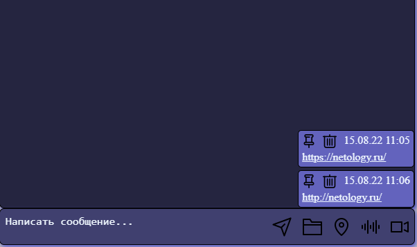
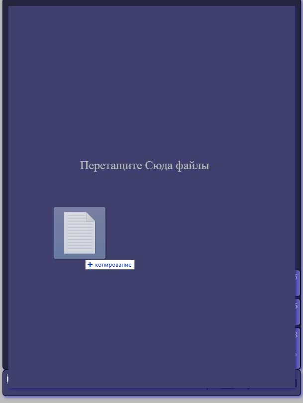
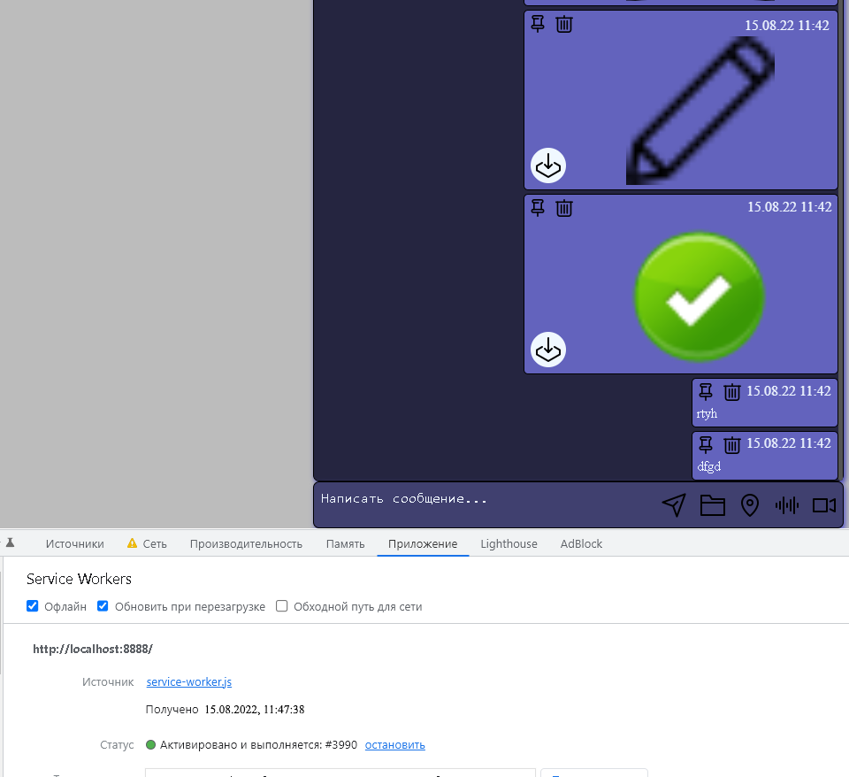

# Chaos Organizer

[Link to Chaos Organizer](https://bombik815.github.io/Chaos-Organizer/)

[Серверная часть](https://github.com/bombik815/ahj-organizer-back.git)

- Сохранение в истории ссылок и текстовых сообщений
- Ссылки (то, что начинается с http:// или https://) должны быть кликабельны и отображаться как ссылки

- Сохранение в истории изображений, видео и аудио (как файлов) - через Drag & Drop и через иконку загрузки (скрепка в большинстве мессенджеров)

- Скачивание файлов (на компьютер пользователя)

- Ленивая подгрузка: сначала подгружаются последние 10 сообщений, при прокрутке вверх подгружаются следующие 10 и т.д.

- Запись видео и аудио (используя API браузера)
- Воспроизведение видео/аудио (используя API браузера)

- Отправка геолокации с расположением на карте

- Закрепление (pin) сообщений, закреплять можно только одно сообщение (прикрепляется к верхней части страницы)

- Работа в оффлайн-режиме (при этом загруженные сообщения должны кэшироваться и быть доступными после обновления страницы)

- Показывается погода по текущему месту нахождения по команде @bot

